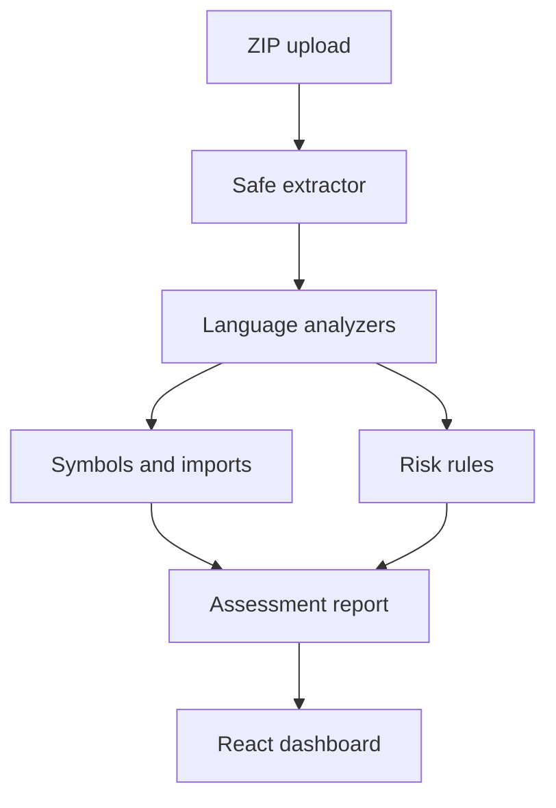

# Legacy Code Intelligence

A portfolio-ready codebase assessment tool that turns an unfamiliar ZIP archive into a searchable inventory, dependency map, risk report, and modernization plan.

## The business problem

Teams inherit applications with missing documentation, unclear dependencies, oversized modules, embedded secrets, and risky modernization paths. Legacy Code Intelligence produces a fast first-pass assessment before engineers change the system.

## What the MVP analyzes

- File and language inventory
- Functions, classes, imports, and module relationships
- Lines of code and complexity signals
- Large-file, long-function, TODO, wildcard-import, debug-code, and possible-secret risks
- Per-file health scores and evidence-backed findings
- Prioritized modernization recommendations
- JSON report export
- Safe ZIP extraction with traversal, size, and file-count limits

The analyzer is deterministic and does not upload code to an AI provider. It is designed as an explainable foundation for an optional local-LLM documentation layer.

## Architecture



## Quick start

### API

```bash
cd backend
python -m venv .venv
# Windows: .venv\Scripts\activate
# macOS/Linux: source .venv/bin/activate
pip install -r requirements.txt
uvicorn app.main:app --reload
```

### Dashboard

```bash
cd frontend
npm install
npm run dev
```

Open `http://localhost:5173`. The API documentation is at `http://localhost:8000/docs`.

### Analyze the included sample

```bash
cd backend
PYTHONPATH=. python -m app.cli ../sample/legacy_app
```

## API

| Method | Endpoint | Purpose |
|---|---|---|
| `GET` | `/health` | Service status |
| `GET` | `/api/demo` | Analyze the built-in demonstration project |
| `POST` | `/api/analyze` | Analyze an uploaded ZIP archive |

## Safety boundaries

- Archives are extracted into temporary directories and deleted after analysis.
- Absolute paths, parent traversal, symlinks, oversized archives, and excessive file counts are rejected.
- Binary files, dependencies, generated output, and common secret files are skipped.
- Secret detection reports the key name and location, never the suspected value.
- This is an assessment aid, not a security scanner or a substitute for engineering review.

## Tests

```bash
cd backend
pip install -r requirements-dev.txt
pytest
```

## Roadmap

- Interactive dependency graph
- GitHub repository ingestion through OAuth
- Java, C/C++, PHP, REXX, and COBOL AST adapters
- Historical churn and ownership analysis
- Local Llama documentation summaries
- PDF assessment export
- Team workspaces and saved comparisons

## License

MIT

